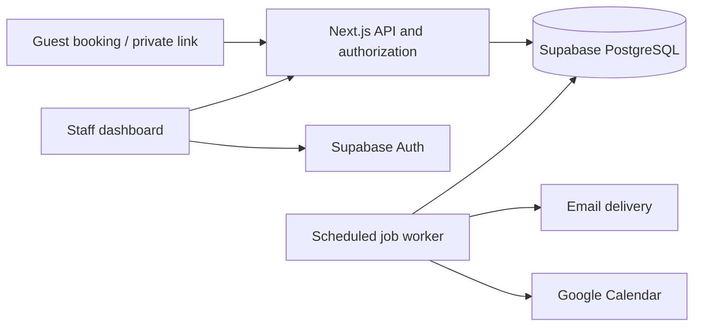
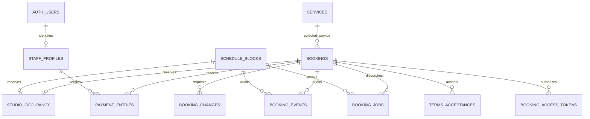

# Elysium database plan — PostgreSQL on Supabase

Status: proposed design, September 24, 2026. This document does not apply migrations or provision a Supabase project.

## Architecture and scope

Use Supabase for managed PostgreSQL and staff authentication. Keep the existing Next.js API routes and server-only `pg` data-access layer. Customers continue booking as guests and managing a booking through its private link. **The owner selected Supabase staff sign-in during this planning session.** Staff Auth and the structured schema below are proposed work, not features already implemented.

PostgreSQL is authoritative for availability, booking status, verified payments, and refund obligations. Google Calendar is an outbound projection. Editing Google Calendar does not change a reservation. The owner confirmed that staff make booking changes through Elysium, with Google Calendar serving as a viewing tool.

Keep application tables in a private `elysium` schema. Use schema-qualified SQL throughout. No browser reads or writes to these tables directly. A Supabase JavaScript client is useful for staff Auth; it is not required to replace `pg` for database queries. Defer customer accounts, memberships, multiple locations, automated payment processing, and Realtime until there is a product need.

## Existing implementation to preserve

The working tree already contains a backend in `lib/server/` and three migrations in `db/migrations/`. These are the baseline, including changes currently uncommitted. This review inspected the repository, not a deployed database; whether real bookings need migration is still unknown.

| Area | Exists today | Target |
| --- | --- | --- |
| PostgreSQL tables | `bookings`, `studio_occupancy`, `booking_events`, `booking_jobs`, `booking_rate_limits`; runner-owned `booking_migrations` | Retain their responsibilities; split structured booking details, changes, payments, access, and blocks into related tables |
| Booking storage | Contact email plus most state inside `bookings.data` JSONB | Typed columns for operational data; JSONB for event snapshots and job payloads |
| Staff access | Per-booking bearer links; no staff account or dashboard | Supabase Auth plus active staff membership and a staff queue |
| Payments | Cumulative verified deposit, balance, and refund totals | Append-only receipt/refund ledger with staff attribution |
| Database access | One server-only `pg` pool using `DATABASE_URL` | Separate runtime and migration credentials; worker connection compatible with its locking model |

Supabase hosting does not require a schema rewrite. First establish a secure connection and rehearse the existing migrations in a development project. Deliver the structured schema and staff sign-in as subsequent application changes before the target production cutover.

| Current behavior | Database consequence |
| --- | --- |
| Control room: $50/hour; full studio: $100/hour | Two service options, currently sharing one physical studio |
| Either option reserves the studio | One shared exclusion constraint; do not partition availability by service |
| Minimum two hours; 30-minute increments; three-calendar-month booking horizon | Validate in studio-local time and store absolute timestamps |
| Open 24/7; maximum 23 elapsed hours from the selected start | No opening-hours or recurring-slot tables needed for version one; enforce duration when quoting, creating, or changing sessions; explicit closures use schedule blocks |
| Studio timezone: `America/New_York` | `timestamptz` for instants; retain the IANA timezone for display and policy evaluation |
| Fifteen minutes of cleanup after each session | Occupancy ends fifteen minutes after the session ends |
| 50% initial deposit, manual Cash App verification and staff approval | Separate reported payment from verified receipt and booking approval |
| Pending approval expires after 48 hours or at session start, whichever is earlier | Indexed approval deadline; expiration releases occupancy |
| Change requests reserve both the original and proposed slots | One occupancy multirange per booking |
| Deposit becomes nonrefundable at the 24-hour cutoff and stays so after rescheduling | Persist the irreversible cutoff decision and original deposit amount |
| Current rates are copied into each booking | Preserve both rates so a later service change uses the booking's original prices |

These rules come from `docs/booking-requirements.md`, `lib/booking-policy.ts`, and `lib/server/bookings.ts`; they are the current implementation, not new business decisions. Tax configuration and pricing confirmation are still launch prerequisites; this plan does not determine tax treatment.

The current schema already has useful request idempotency, a GiST overlap constraint, booking events, and a durable job queue. Its main limitation is that most booking state lives in one `bookings.data` JSON document. Move fields used for joins, validation, filtering, and financial history into typed columns.

## Proposed schema

Use UUID primary keys for business entities, `bigint` identities for append-only events/jobs, `timestamptz` timestamps, and integer cents for money. Start with USD and a `currency` column constrained to `USD`. Use text columns with `CHECK` constraints for statuses. `jsonb` remains useful for bounded event metadata and delivery payloads.

All tables below belong to `elysium`, except Supabase-managed `auth.users`. UUID IDs default to `gen_random_uuid()` where appropriate. Foreign keys generally restrict deletion; use explicit anonymization and retention jobs rather than cascading away financial history.

| Table | Main columns | Purpose and constraints |
| --- | --- | --- |
| `services` | `id text PK`, `name`, `hourly_rate_cents`, `active` | Seed `control` and `studio`; rates nonnegative. Deactivate instead of deleting. |
| `bookings` | `id`, `reference`, `request_key`, `request_hash`, `version`, `artist_name`, `email`, `phone`, `service_id FK`, `starts_at`, `ends_at`, `timezone`, `status`, `control_rate_cents`, `studio_rate_cents`, `tax_bps`, `subtotal_cents`, `tax_cents`, `total_cents`, `deposit_due_cents`, `currency`, `approval_deadline`, `payment_reported`, `payment_reported_at`, `nonrefundable`, `nonrefundable_at`, `cancellation_refundable`, `cancelled_at`, `test_mode`, `created_at`, `updated_at` | Unique reference and request key. Guest contact snapshot belongs to the booking. Statuses: `pending`, `confirmed`, `cancelled`, `declined`, `expired`, `completed`. Booleans preserve legacy facts even when exact historical timestamps are unknown. |
| `booking_changes` | `id`, `booking_id FK`, `requested_against_version`, `service_id FK`, `starts_at`, `ends_at`, `subtotal_cents`, `tax_cents`, `total_cents`, `status`, `expires_at`, `requested_at`, `resolved_at`, `resolved_by FK staff_profiles` | Retain proposed changes after resolution. Statuses: `pending`, `approved`, `declined`, `withdrawn`, `expired`, `superseded`. Unique partial index on booking ID where status is pending. |
| `schedule_blocks` | `id`, `starts_at`, `ends_at`, `buffer_minutes`, `reason`, `import_hash`, `test_mode`, `released`, `created_by FK staff_profiles`, `created_at`, `released_at` | Closures, maintenance, and imported reservations. Separate these from paying guests. Preserve the current 15-minute buffer for imported legacy blocks; allow explicit zero-buffer closures. Stable IDs plus import hashes retain retry/conflict behavior. Release timestamps may be unknown for legacy rows. |
| `studio_occupancy` | `id`, `booking_id FK UNIQUE NULL`, `block_id FK UNIQUE NULL`, `occupied tstzmultirange` | Exactly one owner: booking or block. Nonempty, finite, half-open ranges. Global GiST exclusion on overlapping occupancy. |
| `payment_entries` | `id`, `booking_id FK`, `request_key UNIQUE`, `request_hash`, `kind`, `allocation`, `amount_cents`, `currency`, `method`, `external_reference`, `verification_note`, `recorded_by FK staff_profiles`, `occurred_at`, `created_at`, `reverses_entry_id FK NULL`, `source` | Append-only verified receipts, refunds, and reversals. Each amount is positive. Receipt allocation is deposit or balance. Require an actor and verification evidence for new manual entries; mark legacy imports explicitly. |
| `terms_acceptances` | `id`, `booking_id FK`, `change_id FK NULL`, `terms_version`, `accepted_at`, `accepted_booking_version`, `terms_content_hash`, `source` | Record initial acceptance and every change acceptance. Retain the exact versioned terms text in source-controlled artifacts. Legacy unknown version/hash fields may be null; new acceptances require them. No need to collect IP addresses for this design. |
| `booking_access_tokens` | `id`, `booking_id FK`, `token_hash UNIQUE`, `nonce`, `key_version`, `format_version`, `expires_at`, `revoked_at`, `created_at` | Guest management credentials only. No raw bearer token stored. Support legacy HMAC links, revocation, and signing-key rotation. |
| `staff_profiles` | `user_id PK/FK auth.users`, `display_name`, `role`, `active`, `created_at` | Invite-only `owner` and `staff` roles; disable membership to revoke staff access. Retain referenced profiles for audit history. |
| `booking_events` | `id`, `booking_id FK NULL`, `block_id FK NULL`, `booking_version NULL`, `event_type`, `actor_type`, `actor_user_id FK staff_profiles NULL`, `metadata jsonb`, `created_at` | Append-only audit trail with exactly one booking/block owner. Distinguish guest, staff, system, and legacy operator actions; never store credentials in metadata. |
| `booking_jobs` | `id`, `booking_id FK NULL`, `block_id FK NULL`, `event_id FK NULL`, `kind`, `dedupe_key UNIQUE`, `payload jsonb`, `attempts`, `available_at`, `lease_token`, `leased_until`, `completed_at`, `failed_at`, `last_error` | Transactional outbox for guest email, staff email, and calendar sync. Exactly one booking/block owner. Recovery jobs can have no booking event. |
| `booking_rate_limits` | `key PK`, `window_start`, `count` | Retain hashed rate-limit subjects; periodically remove expired windows. |

Do not introduce a `customers` table yet: an email supplied during guest checkout is not a verified identity, and shared email addresses must not merge people. Booking contact snapshots preserve history. Customer accounts can later link through a verified claim flow.

The two occupancy relationships are mutually exclusive. Rate limits and auxiliary foreign keys are omitted from the diagram for readability.

### Types and relational constraints

- Money columns use `bigint` cents, not floating-point dollars. `pg` returns these values as strings by default: convert only after checking the JavaScript safe-integer range, and validate aggregate totals too. Keep the existing server price and rounding policy in one shared function.
- `tax_bps` uses `numeric(6,1)` with a 0–10,000 check. The current code supports tenths of a basis point; an integer column would lose precision. For example, 887.5 basis points means 8.875%, purely as a storage example.
- Use `timestamptz` for all instants and `timezone text` fixed to `America/New_York` for this version. Normalize booking emails by the existing trim/lowercase rule, without a unique email constraint. Phone numbers remain text.
- New booking fields are required except optional event timestamps. `payment_reported` and `nonrefundable` default false; their timestamps may remain null for legacy rows whose exact event time is unavailable. Never invent those times during backfill. Preserve `test_mode`, and prevent test records entering the live database.
- The occupancy owner check is exactly one of `booking_id` or `block_id` being non-null, with a unique constraint on each. Require nonempty occupancy and finite, lower-inclusive/upper-exclusive component ranges; implement component validation in a database helper/check or trigger. No `btree_gist` extension is needed for the current single multirange overlap constraint.
- Ensure a terms acceptance's `change_id` belongs to the same booking using a composite foreign key. Do the same for a ledger reversal's original entry. A partial unique index prevents reversing an entry twice; a transactional validation step checks its kind, matching amount/allocation, and financial effect.
- Retain staff profiles referenced by payments/events; disable them rather than deleting audit attribution. The normal runtime role has read-only access to memberships and services, insert/read access to ledger/events/terms, and narrowly scoped mutable access to operational tables. It has no DDL or migration-history access.

## Integrity and booking transactions

### Prevent double bookings in PostgreSQL

Retain the existing `EXCLUDE USING gist (occupied WITH &&)` design. Each booking owns a multirange containing its current slot and any active proposed slot, each extended by the cleanup buffer. Overlapping portions of the same booking's ranges merge naturally. Different owners cannot overlap. PostgreSQL documents range overlap constraints in its [range-type guide](https://www.postgresql.org/docs/current/rangetypes.html).

Use `[start, end + buffer)` bounds. For example, a session ending at 12:00 blocks the studio until 12:15; because bookable starts use half-hour increments, the next eligible start is 12:30. Both service options compete for this same occupancy.

The occupancy rows are an enforced scheduling projection of bookings, changes, and blocks. Every relevant write must update that projection in the same transaction; a reconciliation check should detect missing or mismatched rows. An exclusion constraint alone cannot detect a booking whose occupancy row was never created.

### One atomic mutation

1. Run due-hold expiration in its own committed transaction, as the existing `sweep()` does, so an invalid submitted action cannot roll back cleanup. Authenticate the guest credential or staff session and validate the submitted action.
2. Start a database transaction. Retain the current transaction-scoped studio advisory lock for the initial single-studio implementation; lock the affected booking row and check its version.
3. Recheck deadlines using server time under the lock. Keep scheduled expiration as well, so abandoned holds do not depend on customer traffic. Never put `now()` in a partial-index predicate to simulate automatic expiration.
4. Validate the transition, local-time rules, price snapshot, payment totals, and availability.
5. Write the booking/change/payment/terms records, replace occupancy, increment the booking version, and append the audit event and outbox jobs.
6. Commit. Translate exclusion violation `23P01` into a booking conflict. Perform provider network calls after the transaction.

Creation retries with the same request key and canonical payload return the existing booking; changed payloads return a conflict. Resolve an existing idempotent request before applying fresh start-time validation, so a late retry can still retrieve its successful result. Version checks prevent stale staff/guest updates; payment command keys additionally prevent duplicate financial entries.

Validate `ends_at > starts_at`, session duration of at least 120 minutes in multiples of 30, finite timestamps, nonnegative cents, `tax_bps` from 0 to 10,000, and `subtotal + tax = total`. Apply session rules to bookings/changes, not arbitrary closure blocks. Enforce half-hour wall-clock alignment and the three-month horizon on the server using `America/New_York`; test daylight-saving transitions. Avoid time-dependent `CHECK` constraints that would invalidate stored historical bookings.

### State and policy

`pending` becomes `confirmed` after staff verifies the original deposit and approves before the deadline. It can also become `cancelled`, `declined`, or `expired`. `confirmed` can become `cancelled`, `declined` by staff under the current policy, or `completed` after the session ends. Terminal states reject ordinary booking modifications; verified payment/refund reconciliation can still occur afterward. Cancellation, decline, and expiry release occupancy.

One intended correction: completion must retain occupancy until `ends_at + 15 minutes`, then cleanup may remove it. The current `save()` deletes occupancy immediately for all terminal states. Retaining the remaining buffer makes the database honor cleanup even when staff completes a session immediately after its end.

Every guest-requested time or service change requires explicit staff approval, even when the requested slot is available; the owner confirmed this rule during the walkthrough. Changes have their own lifecycle. Until approval, keep both slots reserved. Approval atomically replaces the booking's service/time/price snapshot and releases the old slot. Withdrawal, rejection, and expiry release only the proposed slot. Preserve current expiry rules: at most 48 hours, bounded by the original/proposed start, or the original end for an in-progress extension. Once started, only extending the current session's end is allowed. Approving a change can confirm a pending booking if its original deposit is verified, matching existing behavior.

The current guest flow can replace a pending proposal. Preserve that behavior by marking the old change `superseded` before inserting its replacement, within the same transaction. When the booking itself closes, resolve its pending change as withdrawn (cancellation), declined (staff decline), or expired (approval timeout), and enqueue calendar reconciliation.

Snapshot both service rates and tax basis points at creation. The initial deposit remains fixed after a service/time change, even if the new total is lower; do not constrain it to the current total. Persist nonrefundability irreversibly, with its first effective timestamp when known. Check the old slot's cutoff before replacing it, and the new slot's cutoff afterward; never clear the flag on rescheduling. Store cancellation eligibility at cancellation time rather than recomputing it later.

### Payments and refunds

“Payment sent” is a customer report, not a verified receipt. Staff records individual receipts and actual refunds with verification notes/references; derive `deposit_paid`, `balance_paid`, and `refunded` from ledger entries. Do not continue overwriting cumulative totals.

Use `receipt`, `refund`, and `reversal` entry kinds. A reversal references one receipt/refund from the same booking and negates its full contribution; allow at most one reversal per original, disallow reversing a reversal, and correct an amount by reversing then recording a replacement. Lock the booking while checking aggregate balances and refund limits; ordinary row checks cannot enforce these sums. Deny runtime update/delete privileges on ledger rows. Imported totals are opening entries with `source = legacy_import`, not invented historical transactions.

Store a canonical payload hash with each payment request key; a replay returns the recorded result and a different payload conflicts. Validate the final ledger totals after the whole correction transaction: net receipts/refunds cannot be negative, and net refunds cannot exceed the current entitlement. A reversal cannot hide a transfer that actually happened. Replacing a misrecorded receipt and any associated bookkeeping correction must be reviewed together if an existing refund would otherwise exceed entitlement.

Preserve current refund entitlement: declined/expired bookings owe all verified receipts; eligible cancellations owe all receipts; late cancellations retain up to the original deposit; completed bookings owe any overpayment. Refund owed is entitlement minus actual refunds, floored at zero. Record receipt/refund occurrence times separately from data-entry times. A recorded refund means staff verified the transfer; this database does not send money. Duplicate provider references should be unique where the provider guarantees uniqueness; freeform Cash App notes alone do not establish it.

## Access and Supabase configuration

Use separate local/test and production environments. Choose a Supabase region near the app deployment and expected customers. Keep test bookings and test delivery credentials out of production.

| Actor | Allowed access |
| --- | --- |
| Public visitor | Availability and quotes with no guest details; validated booking creation and recovery request endpoints |
| Guest private link | Only its booking's safe DTO and permitted guest actions until expiry; no payment verification or internal notes |
| Active staff | Staff dashboard, approvals, schedule blocks, verified payments/refunds, and operational history |
| Owner | Staff permissions plus membership administration |
| Worker | Expiration and job processing through restricted server code |

Verify staff sessions on the server using the supported Supabase Auth verification API, then check `staff_profiles.active` and role for every privileged operation. Do not trust client role metadata or UI visibility. A successful sign-in without active staff membership grants no studio access. Owner membership administration should use a separately privileged server operation; ordinary staff must not be able to promote themselves. Follow Supabase's [server-side Auth setup](https://supabase.com/docs/guides/auth/server-side/creating-a-client?queryGroups=framework&framework=nextjs) when implementing this.

Bootstrap the first owner by inviting a known staff email through a trusted administrator and inserting the matching Auth user ID into `staff_profiles` through the migration/admin connection. Disable public staff registration. Keep this manual administration workflow for version one; a self-service membership screen can come later. Signed-in staff can review any booking in the studio. Staff mutations use the verified account ID for audit attribution, check request origin/CSRF protection when using cookies, and return private, non-cacheable responses. Disabling membership must deny the next privileged request even if an Auth session is still valid.

Disable the Data API if it is unused; keep `elysium` outside exposed schemas and revoke browser-role access explicitly. Configure default privileges for the actual migration owner. Supabase explains these separate exposure controls in [Securing your API](https://supabase.com/docs/guides/api/securing-your-api).

Enable RLS on application tables with no policies for `anon` or `authenticated`. The server connects as a dedicated, non-owner `elysium_app` database role with only required grants and explicit policies scoped to that trusted role. These server-role policies allow the required rows; guest/staff authorization remains in the server data-access layer. Direct `pg` connections do not automatically carry a user's Auth JWT or make `auth.uid()` identify that user. Do not run production requests as `postgres`, assume RLS bypass is user authorization, or expose credentials in `NEXT_PUBLIC_*`. Supabase documents policy and bypass behavior in its [RLS guide](https://supabase.com/docs/guides/database/postgres/row-level-security).

Keep guest credentials scoped to one booking and expiring at its current session end. Update expiry when an approved reschedule changes that end. Preserve current HMAC links during migration with their nonce, hash, signing key, and format version; retaining the nonce plus a separately held server key permits recovery email generation without storing raw links. Reject revoked credentials. Recovery must not revoke someone else's access merely because an unverified email address was submitted. Replace staff bearer links with authenticated dashboard links and invalidate legacy staff-link authorization at cutover. Exclude token material and internal payment notes from guest responses and logs.

### Connections and workers

| Workload | Connection plan |
| --- | --- |
| Current backend, before changes | Supavisor session mode or direct PostgreSQL; all paths currently share `DATABASE_URL` |
| Target Next.js API | Supavisor transaction pooler (`6543`), dedicated runtime role, small per-instance pool |
| Migrations | Separate privileged connection via direct PostgreSQL, or session pooler (`5432`) when needed for IPv4 |
| Current job worker | Session/direct connection because it uses `pg_try_advisory_lock` across statements |
| Target worker | Transaction pooler after replacing the session lock with durable job claims |

Copy exact connection strings from the Supabase Connect dialog. Configure certificate verification and begin with one application connection per serverless instance, increasing only from observed contention. Avoid named prepared statements with the transaction pooler. Transaction-scoped advisory locks and `SET LOCAL` inside an explicit transaction remain suitable. These choices follow Supabase's [PostgreSQL connection guide](https://supabase.com/docs/guides/database/connecting-to-postgres).

Proposed configuration adds `MIGRATION_DATABASE_URL` and, during transition, `JOB_DATABASE_URL`; these variables do not exist in the current code yet. Update the migration/worker clients before using separate credentials or connection modes. Do not simply change the shared URL to transaction pooling while keeping the current worker lock.

For durable job claims, use a short transaction with `FOR UPDATE SKIP LOCKED`, set a unique lease token and deadline, then commit before delivery. Complete/retry only if the worker still owns that lease; recover abandoned leases. Use provider idempotency keys where available, exponential backoff, and an explicit failed state after bounded attempts. This is at-least-once delivery, so duplicate external effects must be handled. For calendar writes, serialize jobs per booking/block, skip superseded versions, and reconcile to the latest desired state after retries; use a lease long enough for bounded network calls or renew it while working.

Email jobs should carry an immutable event snapshot so an old event is not described using unrelated newer booking details. Generate still-valid private links at send time. Calendar jobs should use the current desired state. Retain the existing scheduled trigger, adjusted to the deployment's supported frequency, and add alerts for overdue approvals, old jobs, repeated failures, and outstanding refunds.

## Indexes and operational rules

Add indexes based on actual access paths:

- `bookings(status, starts_at)` for staff queues; `bookings(email, created_at DESC)` for recovery.
- Partial `bookings(approval_deadline) WHERE status = 'pending'`.
- Partial `booking_changes(expires_at) WHERE status = 'pending'`, plus the unique pending-change index.
- The GiST occupancy exclusion index; no duplicate overlap index.
- Child foreign-key indexes and `(booking_id, created_at)` on payments/events; unique token hash.
- Partial jobs index on `(available_at, id) WHERE completed_at IS NULL AND failed_at IS NULL`.

Expose server-side staff queries for upcoming sessions, pending approvals/changes, amounts owed, refunds owed, and failed jobs. Derive financial totals from the ledger rather than maintaining a second writable balance. Keep booking audit events and financial history through cancellations. Set an owner-approved contact-data and delivery-payload retention policy before launch; remove expired rate-limit rows automatically. Configure backups appropriate to the selected Supabase plan and rehearse a restore into an isolated environment.

## Implementation and migration sequence

1. **Foundation:** configure Supabase environments, schema, runtime/migration roles, grants/RLS, connection clients, and staff Auth. Keep the existing migration runner as the single authority initially; PostgreSQL hosted on Supabase does not require changing it. Add ordered migrations under `db/migrations/`, and record checksums going forward so edited applied files are detected.
2. **Structured schema:** add the proposed tables/columns in new migrations, seed services, implement typed queries and DTO adapters. Preserve API contracts where possible; update staff authentication and payment entry UX explicitly. Add immutable terms records and durable job claims.
3. **Backfill rehearsal:** inspect whether any real bookings exist. For existing data, back up and validate IDs, contacts, statuses, timestamps, prices, and pending proposals. Preserve booking UUIDs, references, request hashes, versions, guest tokens, and frozen rates. Identify manual blocks by `data.termsVersion = 'manual-block'`, including released blocks whose status is now `declined`, and convert them to schedule blocks with stable IDs. Keep the old JSON as a read-only migration snapshot until parity is verified.
4. **Financial/history conversion:** create opening ledger entries from deposit/balance/refund totals. Do not infer individual payments or staff identities from aggregate data. Preserve existing events with legacy actor labels. Backfill only known terms acceptances; unresolved historical acceptance details must be marked unknown, not fabricated. Map existing jobs to new owners and dedupe keys without resending already completed work.
5. **Controlled cutover:** for this single-studio project, prefer a short booking/staff write pause and stopped workers. Backfill the final delta, compare row counts, ledger totals, availability, proposals, and tokens, then switch application queries and worker processing together. Preserve calendar event IDs for bookings and imported blocks so migration does not duplicate external events. Recompute occupancy under the same rules and reject any conflicts for review. Resume writes only after checks pass. Avoid prolonged dual writes.
6. **Production validation:** run the scenarios below against actual PostgreSQL, check grants using the intended roles, and smoke-test the deployed guest/staff flows and scheduled worker. Archive legacy fields only after a stable observation period and a recoverable backup.

If no production data exists, skip legacy backfill and use a fresh schema seeded only with services and the first staff membership. Still apply migrations from source control and test the whole path from an empty database. Do not rewrite migrations `001`–`003` that may already have been applied elsewhere.

### Repository implementation map

| Files | Planned changes |
| --- | --- |
| `db/migrations/004_*.sql` onward | Create private schema and structured tables, constraints, indexes, grants, and policies; add explicit backfill/cutover migrations where needed |
| `scripts/migrate.mts` | Dedicated migration connection, explicitly located migration-history table, checksums for future files; preserve already-applied names and history |
| `lib/server/db.ts`, `.env.example` | Distinct runtime/migration/temporary worker connections, verified TLS, bounded pools; keep `pg` and the transaction-scoped studio lock |
| `lib/server/bookings.ts` | Replace JSON reads/writes with typed repositories and ledger queries; preserve guest DTOs and enforce occupancy updates atomically |
| `lib/server/security.ts`, new server Auth helpers | Keep guest capabilities; verify staff Auth and membership independently of guest authorization |
| `app/staff/`, `app/api/staff/`, `components/booking/ManageBooking.tsx` | Staff login, booking queue and booking-ID navigation; receipt/refund entry amounts replace cumulative amount inputs |
| `lib/server/jobs.ts`, `scripts/jobs.mts` | Durable leases, stable provider deduplication, immutable email snapshots, current-state calendar sync, authenticated staff URLs |
| `scripts/studio.mts` | Move imports/releases to schedule blocks; retire staff bearer-link generation; retain guest-link rotation and trusted operator commands |
| `tests/bookings.integration.test.ts` and new database/Auth tests | Schema parity, ledger and occupancy constraints, role permissions, staff authorization, migration and worker recovery scenarios |

The current SQL uses unqualified names and normally creates tables in `public`. Explicitly discover the actual legacy schema during migration rehearsal. Build new tables under `elysium`, copy validated data, and switch to schema-qualified queries at cutover. Keep the old schema inaccessible to browser roles and read-only to runtime clients afterward. Do not change `search_path` and accidentally create a second `booking_migrations` table that reruns old migrations.

### Legacy field mapping

| Current source | Target and migration rule |
| --- | --- |
| `data.customer`, `data.slot`, `data.rates`, `data.taxBps` | Booking contact/time/rate columns; compute current price with the existing shared price function |
| `data.depositDue` | Frozen `deposit_due_cents`; never recalculate it from the current slot |
| `data.proposal` | Pending change plus its known terms acceptance; preserve proposal UUID for calendar identity |
| `data.depositPaid`, `data.balancePaid`, `data.refunded` | Up to three positive opening ledger entries; omit zero totals and mark unknown occurrence times/actors as legacy |
| `data.paymentReported`, `data.nonrefundable`, `data.cancellationRefundable`, `data.testMode` | Preserve boolean facts; fill event timestamps only when audit evidence supports them |
| `data.nonce`, `data.guestHash` | Active guest token with legacy format/key version and approved-end expiry; retain the signing secret securely |
| `data.staffHash` | Retire at staff Auth cutover; do not migrate into a working staff credential |
| `data.termsVersion`, `data.acceptedAt`, event metadata | Known acceptance records and audit snapshots; do not manufacture missing history or content hashes |
| Manual-block records | Schedule blocks using original stable UUIDs and import hashes; preserve released state and move their events/jobs to block ownership; no fake customer or payment record |
| Existing events/jobs | Preserve audit metadata and delivery state; map owner IDs, retain provider idempotency keys for retries, and avoid re-enqueuing completed jobs |

Before writes resume, rollback can restore the previous application and schema snapshot. After new ledger entries or bookings arrive, reverting only the application would lose consistency: pause writes again and reconcile/replay the delta or roll forward. Document that decision in the cutover runbook.

If adopting the Supabase CLI later, explicitly baseline the existing migrations and retire the custom runner; never let both independently own migration history. Supabase describes its separate tracking in [Database Migrations](https://supabase.com/docs/guides/deployment/database-migrations).

### Acceptance scenarios

- Concurrent booking requests for the same time across both services: exactly one succeeds.
- Cleanup-buffer collision, adjacent valid intervals, midnight sessions, and daylight-saving transitions.
- Completion immediately after session end retains the remaining cleanup buffer, including against imported blocks.
- Pending requests and change holds expire; failed or invalid requests do not leave stale committed reservations.
- Overlapping original/proposed ranges from the same booking work; another booking cannot take either hold.
- Retried creation/payment commands do not duplicate records; stale versions fail cleanly.
- Approval requires verified deposit; reporting payment alone never confirms a booking.
- Rescheduling retains original deposit/rates and irreversible nonrefundability; refund/overpayment formulas match existing policy.
- Ledger reversal and concurrent refund recording preserve totals and prevent excess refunds.
- Fractional tax basis points round exactly as before; legacy flags survive without fabricated timestamps; replacing a proposal preserves its history.
- Guest tokens cannot reach other bookings; revoked/expired links fail; inactive or nonstaff Auth users cannot perform staff actions.
- Anonymous/authenticated Data API access reveals no booking records; runtime role cannot change schema, promote staff, or edit ledger history.
- Worker crash, provider timeout, stale calendar job, and lease recovery do not lose committed work.
- Legacy backfill preserves availability, financial totals, private guest links, event history, and calendar IDs.

## Remaining product choices

Proceed with the existing shared studio, 24/7 availability, a 23-hour maximum session duration, guest checkout, and manual Cash App workflow. Supabase staff sign-in is confirmed. Remaining setup inputs are the Supabase project/environment and region, whether there is live data to migrate, the first owner's email, and final pricing/tax configuration. None blocks this design. Customer accounts, independently bookable rooms, and automated payments are outside the current scope.
